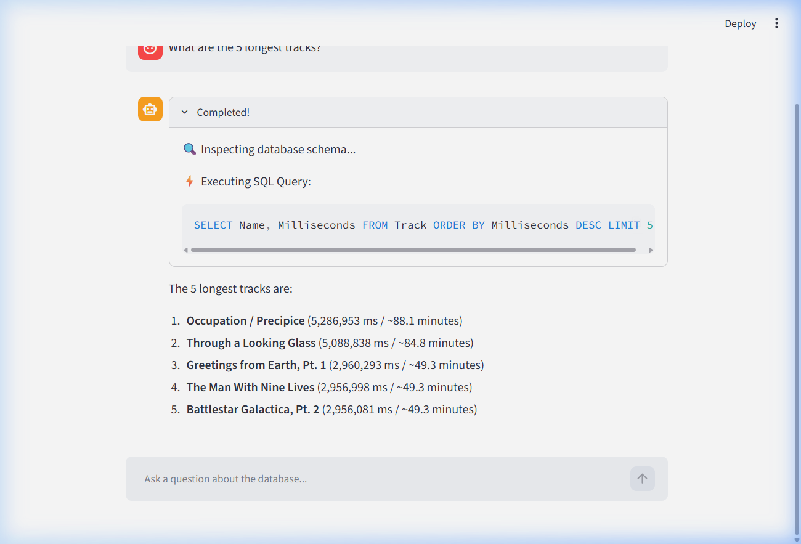
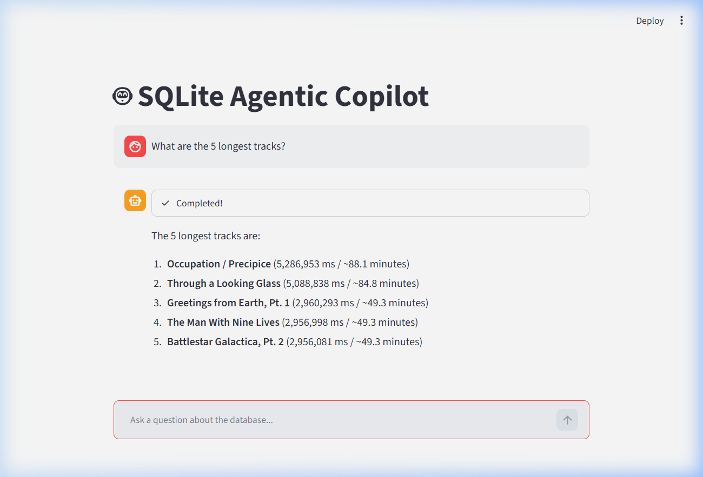
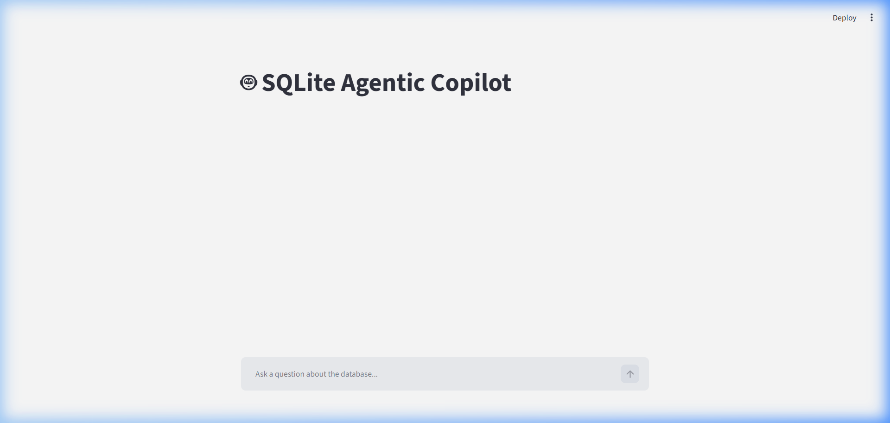

# 🤖 Agentic SQLite Copilot

An intelligent, autonomous AI SQL assistant powered by **Google Gemini** and **Streamlit**. The copilot translates natural language questions into SQLite queries, inspects the database schema on demand, executes safe read-only SQL, and returns concise conversational answers with real-time reasoning visualization.

---

## 📸 Screenshots

### 1. Agent Reasoning & Live Tool Execution
Watch the agent autonomously inspect schema, formulate SQL, and execute queries with real-time visual progress:



### 2. Conversational Result & Data Insights
Clear, direct answers synthesized from relational database results:



### 3. Application Interface
Clean, interactive chat interface built with Streamlit:



---

## ✨ Features

- **🧠 Autonomous Tool Calling:** Utilizes Gemini's tool-use capabilities to autonomously determine whether it needs to inspect table schemas (`get_schema`) or execute SQL queries (`run_query`).
- **🛡️ Built-in Security & Safety Guardrails:**
  - SQL AST analysis via `sqlglot` enforces strict `SELECT`-only execution (blocking `DROP`, `DELETE`, `UPDATE`, `INSERT`).
  - Read-only SQLite connection mode (`?mode=ro`).
  - Row limits (`MAX_ROWS = 50`) to safeguard system memory.
- **⚡ Interactive Streamlit UI:** Features real-time callback hooks that display live thinking steps, tool invocations, and generated SQL queries before rendering final markdown answers.
- **🐳 Dockerized Architecture:** Ready-to-run container setup with Docker Compose.

---

## 🚀 Getting Started

Follow these steps to get the copilot up and running in minutes:

### 1. Configure `.env`

Add your Google Gemini API key to a `.env` file in the root directory:

```env
GEMINI_API_KEY=your_gemini_api_key_here
```

### 2. Launch with Docker Compose

Run the following command in your terminal:

```bash
docker compose up --build -d
```

### 3. Access the Application

Once the container starts, open your browser at:

👉 **[http://localhost:8501](http://localhost:8501)**

To view container logs or stop the application:
```bash
# View live logs
docker compose logs -f

# Stop the container
docker compose down
```

---

## 🧪 Running Tests

Run the test suite inside the container using Docker Compose:

```bash
docker compose run --rm --entrypoint python sqlite-agent test.py
```

---

## 📂 Project Structure

```text
Agentic-sql-copilot/
├── app.py               # Streamlit web application & UI status rendering
├── agent.py             # Agentic loop & Gemini model integration
├── tools.py             # SQLite schema inspector & safe query execution engine
├── chinook.db           # Sample SQLite database - downloaded via Dockerfile
├── Dockerfile           # Docker container setup
├── docker-compose.yml   # Container orchestration configuration
├── requirements.txt     # Python package dependencies
├── .env.example         # Example environment configuration
└── screenshots/         # UI and execution demo screenshots
    ├── copilot_home.png
    ├── copilot_reasoning.png
    └── copilot_chat.png
```

---

## 💡 Example Queries to Try

- *"What are the titles of the 5 longest songs?"*
- *"Which artist has released the most albums?"*
- *"Who are the top 5 customers by total spending?"*
- *"Which genre has the highest number of tracks?"*
- *"Show me the total invoice sales for each country."*

---

## 🛠️ Tech Stack & Python Tools

This project is built with **Python 3.11**, leveraging its modern ecosystem for agentic AI, SQL parsing, database management, and reactive UI:

### 🐍 Python Ecosystem & Libraries
- **[Python 3.11](https://www.python.org/):** The core programming language powering the agentic loop, backend logic, and container runtime.
- **[`google-genai`](https://pypi.org/project/google-genai/) (Google GenAI SDK):**
  - Connects to Google's `gemini-3.5-flash-lite` model.
  - Implements the agent's function-calling / tool-use interface (`types.GenerateContentConfig` with registered Python tools: `get_schema` and `run_query`).
  - Manages the multi-turn conversational loop and tool execution feedback (`types.Part.from_function_response`).
- **[`streamlit`](https://streamlit.io/):**
  - Reactive Python frontend framework providing the conversational user interface.
  - Manages chat history and UI state seamlessly with `st.session_state`.
  - Dynamically updates execution stages using `st.status` and highlights generated SQL via `st.code`.
- **[`sqlglot`](https://github.com/tobymao/sqlglot):**
  - Powerful Python SQL parser, transpiler, and Abstract Syntax Tree (AST) analyzer.
  - Serves as a vital security guardrail by analyzing generated queries prior to execution (`is_safe_query`).
  - Strictly enforces that only read-only `SELECT` statements are allowed, preventing destructive queries (`DROP`, `DELETE`, `UPDATE`, `INSERT`).
- **[`sqlite3`](https://docs.python.org/3/library/sqlite3.html) (Python Standard Library):**
  - Native SQLite driver used to interact directly with `chinook.db`.
  - Configured with read-only URI mode (`file:chinook.db?mode=ro`, `uri=True`) to guarantee database safety at the driver level.
  - Queries `sqlite_master` and executes `PRAGMA table_info` for dynamic schema inspection.
- **[`python-dotenv`](https://pypi.org/project/python-dotenv/):**
  - Loads environment variables from `.env` directly into Python's `os.environ` for secure API key configuration (`GEMINI_API_KEY`).

### 🐳 Infrastructure & Deployment
- **[Docker](https://www.docker.com/):** Uses the `python:3.11-slim` base image for a lightweight, secure, and reproducible environment.
- **[Docker Compose](https://docs.docker.com/compose/):** Single-command service orchestration that configures DNS, port mappings (`8501:8501`), and automatic restarts.
